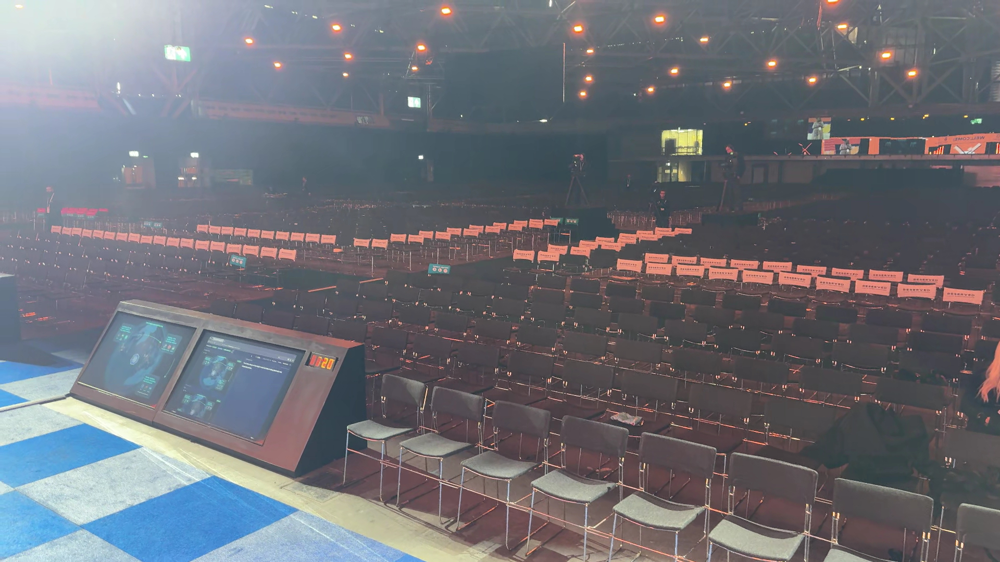
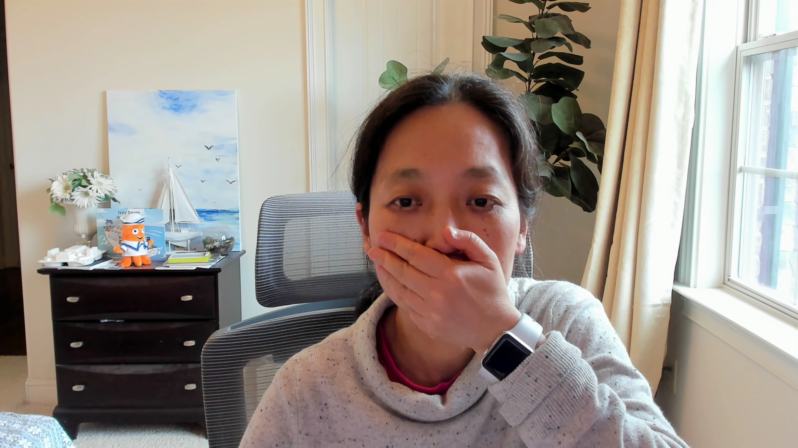

# Drone/Webcam capture analysis – KubeConEU-2026

| Photo 1 | Photo 2 |
|---------|---------|
|  |  |

## LLaVA

Photo 1 is more engaging with a score of 8.0/10 vs Photo 2 at 5.0/10.

Photo 1 analysis: Score: 8
Expression: The subject appears expressive and engaging with an open-mouthed gesture that conveys enthusiasm.
Lighting: Natural light from the window provides soft, flattering illumination with no harsh shadows.
Energy: The raised hand and animated facial expression create a dynamic, attention-grabbing vibe.

Photo 2 analysis: Score: 5
Expression: The subject's neutral expression appears flat and unengaging.
Lighting: Natural window light offers clear, flattering illumination with no harsh shadows.
Energy: The calm, organized background creates a stable but unremarkable visual flow.

Summary: Photo 1 is more engaging due to the subject appears expressive and engaging with an open-mouthed gesture that conveys enthusiasm.

