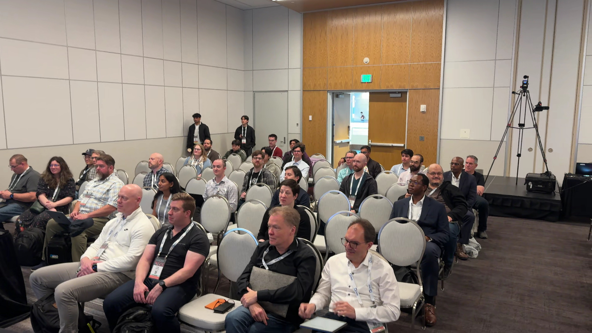
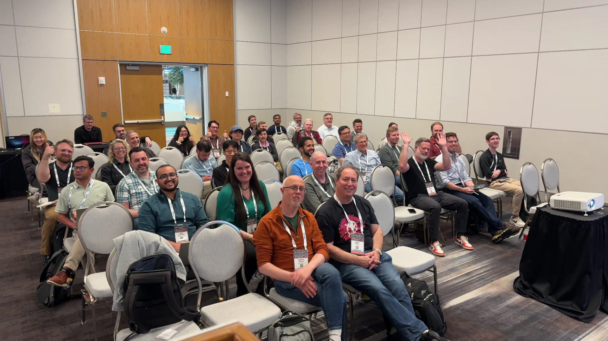

# Photo engagement analysis – ossummit-na-2026

| Photo 1 | Photo 2 |
|---------|---------|
|  |  |

## AI Analysis (qwen3-vl)

Photo 1 score: 5.0/10
Photo 1 expression: Most attendees display neutral or mildly attentive expressions, with minimal visible smiles or active gestures.
Photo 1 energy: The scene feels static and passive, with little dynamic movement or visible engagement from the audience.

Photo 2 score: 8.0/10
Photo 2 expression: Attendees show positive emotions with smiles, thumbs up, and waving gestures, indicating enthusiasm and active participation.
Photo 2 energy: The scene feels lively and interactive, with visible body language reflecting engagement and positive reactions.

Summary: Photo 2 is more engaging because attendees show positive emotions with smiles, thumbs up, and waving gestures, indicating enthusiasm and active participation.

